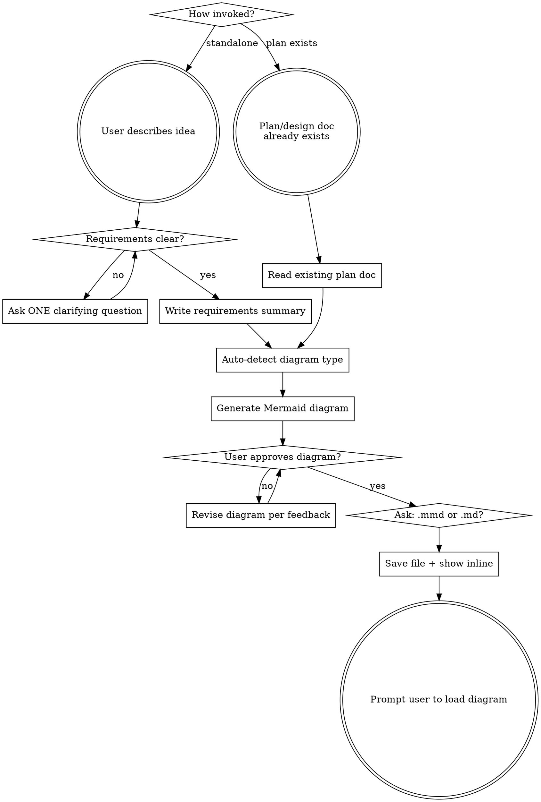

# Prompt to Mermaid

Turn vague ideas into clear requirements and a Mermaid diagram that serves as a machine-readable spec for implementation.

## Process Flow



## Using After Superpowers (Post-Plan Diagramming)

This skill has two entry modes: **standalone** and **post-plan**.

**Skills cannot inject themselves into other skills' workflows.** The superpowers:brainstorming and superpowers:writing-plans skills have closed flows that terminate on their own terms. This skill does NOT run automatically during those flows.

### How to use after superpowers

After superpowers:brainstorming or superpowers:writing-plans completes, the user invokes this skill manually:
- Say: "generate a mermaid diagram from the plan" or "/prompt-to-mermaid"
- Or: "diagram this", "visualize the flow", "create a mermaid diagram"

### Fast path (skip Phase 1)

When a design doc or plan already exists (e.g., in `docs/plans/*.md` from a superpowers session):
- **Skip Phase 1 entirely.** Requirements are already clarified in the existing document.
- Read the existing doc to extract actors, flows, and decisions.
- Jump directly to Phase 2 (diagram generation).
- The existing plan doc serves as the requirements summary — no need to rewrite one.

**How to detect post-plan mode:** Check if `docs/plans/` contains recent `.md` files. If a design doc or plan exists and was written in the current session context, treat this as post-plan mode and skip Phase 1.

## Phase 1: Requirement Clarification Loop

<HARD-GATE>
Do NOT generate any diagram or write any code until requirements are unambiguous. Every vague noun, verb, or interaction must be clarified.
</HARD-GATE>

**How to clarify:**

1. Read the user's initial description carefully
2. Identify ALL ambiguities: unclear actors, undefined flows, missing edge cases, unspecified data, vague scope
3. Ask **one question at a time** — prefer multiple-choice (via AskUserQuestion) when possible
4. After each answer, re-evaluate: are there remaining ambiguities?
5. Continue until you can describe the system without any "it depends" or "presumably"

**What to clarify (checklist):**

- **Actors**: Who/what interacts with the system?
- **Actions**: What does each actor do? What triggers each action?
- **Data flow**: What data moves between components? In what format?
- **Decision points**: Where does the flow branch? What determines each branch?
- **Edge cases**: What happens on failure, timeout, invalid input?
- **Scope boundary**: What is explicitly OUT of scope?

**Exit criterion:** You can write a requirements summary with zero assumptions. If you're guessing, you're not done asking.

**Once clarification is complete**, write a concise **Requirements Summary** as a numbered list. Present it to the user for confirmation before proceeding.

## Phase 2: Mermaid Diagram Generation

### Dispatch parallel sub-agents

Once requirements are confirmed, use the **Task tool to dispatch TWO parallel sub-agents**:

**Sub-agent 1 (Explore):** Analyze the requirements summary and determine the optimal Mermaid diagram type:

- `flowchart TD` — process flows, feature workflows, decision trees
- `sequenceDiagram` — multi-actor interactions, API call chains, request/response flows
- `stateDiagram-v2` — lifecycle states, status transitions, mode switching
- `erDiagram` — data models, entity relationships, database schemas
- `classDiagram` — component architecture, module dependencies, inheritance

**Sub-agent 2 (Explore):** If there is an existing project codebase, scan for existing Mermaid files, architecture docs, or README diagrams to ensure consistency with existing conventions.

### Generate the diagram

After sub-agents complete, generate the Mermaid diagram following these rules:

<MERMAID-GENERATION-PROMPT>
You are converting a structured requirements summary into a Mermaid diagram.

**Selecting diagram type:**
Pick the type that best represents the PRIMARY relationship in the requirements:

- Processes with decisions → flowchart
- Time-ordered interactions between actors → sequenceDiagram
- An entity moving through states → stateDiagram-v2
- Data entities and their relationships → erDiagram
- Components with methods/properties → classDiagram

**Diagram construction rules:**

1. Every node/actor must map to a requirement. No orphan nodes. No decorative elements.
2. Node labels: max 5 words. Use verb phrases for actions ("Validate Input"), noun phrases for entities ("User Service").
3. Edge labels: describe WHAT triggers the transition or WHAT data flows. Never leave edges unlabeled if the relationship isn't obvious.
4. Decision nodes (flowchart): always show all branches explicitly. Label each branch with the condition.
5. Group related nodes using subgraphs (flowchart) or boxes (sequence) when there are 3+ logically grouped items.
6. Keep the diagram under 40 nodes. If larger, split into multiple diagrams and note how they connect.
7. Use consistent direction: TD (top-down) for hierarchical flows, LR (left-right) for sequential processes.
8. For sequenceDiagrams: show the happy path first, then alt/opt blocks for error cases.
9. Use notes (note right of, note over) sparingly — only for information that doesn't fit as a label.
10. Validate syntax: ensure all node IDs are alphanumeric (no spaces), all strings are quoted where required, and all brackets are balanced.

**Style conventions:**

- Rounded nodes `()` for start/end points
- Stadium nodes `([])` for user actions
- Rectangle `[]` for processes
- Diamond `{}` for decisions
- Cylinder `[()]` for databases/storage
- Use `:::className` for highlighting critical paths only if needed
  </MERMAID-GENERATION-PROMPT>

### Iteration loop

1. Present the generated Mermaid code inline in a code block
2. Ask the user: "Does this diagram accurately represent your system? What would you change?"
3. If changes requested → revise and present again
4. Repeat until user approves

## Phase 3: Save and Load

Once the user approves the diagram:

### 1. Ask output format

Use AskUserQuestion to let the user choose:

| Format | File | Contents | Best for |
|--------|------|----------|----------|
| `.mmd` | `<topic-slug>.mmd` | Raw Mermaid syntax only | CLI tools, CI pipelines, Mermaid CLI rendering |
| `.md` | `<topic-slug>.md` | Mermaid wrapped in ` ```mermaid ``` ` code fence | IDE preview (VS Code, IntelliJ with Mermaid extension), GitHub rendering |

**Default recommendation:** `.md` — most IDEs and GitHub render mermaid code fences natively, giving instant visual preview without extra tooling.

### 2. Save files

- **Diagram:** Write to `docs/diagrams/<topic-slug>.mmd` or `docs/diagrams/<topic-slug>.md` based on user choice. Create directories if needed. Use a kebab-case slug derived from the topic.
- **Requirements summary:** Write to `docs/diagrams/<topic-slug>-requirements.md` alongside the diagram.

For `.md` format, structure the file as: a heading with the topic name, followed by the Mermaid code inside a fenced code block with the `mermaid` language identifier (triple backticks + mermaid).

### 3. Prompt the user to load it

> Your Mermaid diagram has been saved to `docs/diagrams/<file>`.
>
> To use this as a spec for implementation, load it into your next Claude session:
>
> - **Claude Code CLI:** Start your message with `@docs/diagrams/<file>` to add it to context
> - **Or:** Ask Claude to read the file at the start of your implementation session
>
> This gives the AI a machine-readable blueprint of your system — much more precise than prose descriptions.

## Red Flags — You're Doing It Wrong

| Symptom                                         | Problem                                                |
| ----------------------------------------------- | ------------------------------------------------------ |
| Generated diagram before asking questions       | Skipped Phase 1. Requirements are assumptions.         |
| Asked 5+ questions in one message               | Overwhelms user. One question at a time.               |
| Diagram has unlabeled edges                     | Missing data flow or trigger information.              |
| Diagram has 40+ nodes                           | Too complex for one diagram. Split it.                 |
| Node labels are full sentences                  | Too verbose. Max 5 words per node.                     |
| User said "sure, looks fine" without engagement | Diagram may be too abstract. Ask about specific flows. |
| Saved file without user approval                | Never persist without explicit "yes, this is correct." |
| Ran Phase 1 when a plan doc already exists      | Fast path: plan doc IS the requirements. Skip to Phase 2. |

## Common Mistakes

- **Jumping to implementation:** This skill produces a DIAGRAM, not code. Do not write implementation code.
- **Choosing the wrong diagram type:** A sequence diagram for a stateless process, or a flowchart for multi-actor interactions. Re-read the type selection rules.
- **Over-engineering the diagram:** Include what's in the requirements. Nothing more. YAGNI applies to diagrams too.
- **Forgetting error paths:** If the requirements mention failure cases, they must appear in the diagram.
- **Re-asking clarified requirements:** When invoked from superpowers, the design doc already has the answers. Read it instead of interrogating the user again.
